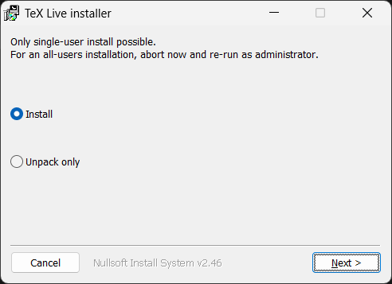
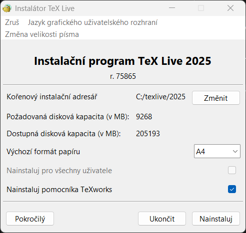
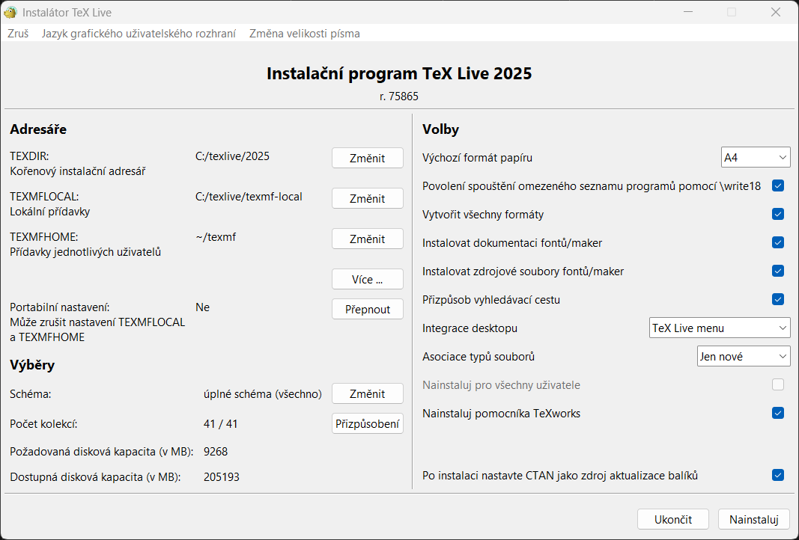

# Návod k používání LaTeXu s VS Code
Tento návod se zabývá využitím textového editoru Visual Studio Code spolu s textovým procesorem LaTeX. Pro kompilaci je využíváno distribuce TeX Live, která je stejně jako VS Code kompatibilní s operačními systémy Windows, Mac i Linux.

## Obsah
1. [Instalace TeX Live](#1-instalace-tex-live)
2. [Instalace VS Code](#2-instalace-vs-code)
3. [Generování výstupu](#3-generování-výstupu)

## 1. Instalace TeX Live
TeX Live je svobodný software pro systém TeX. Varianty pro Windows, Linux i Mac je možné najít na oficiálních stránkách [TeX Live](https://www.tug.org/texlive/). Software je možné instalovat v několika "schématech", které se liší v počtu předinstalovaných balíků a podporovaných jazycích. Je tak možné nainstalovat minimální schéma a požadované balíky doinstalovat pomocí nástroje [tlmgr](https://www.tug.org/texlive/tlmgr.html), který je možné použít v příkazové řádce nebo GUI. Pokud doba instalace a místo na disku nepředstavuje problém, je doporučeno použít plné schéma, popř. omezit jazykové kolekce na "czechslovak".

### Instalace ve Windows

Z webové stránky https://www.tug.org/texlive/windows.html stáhněte instalační soubor "install-tl-windows.exe".

Po spuštění instalace se objeví následující okno.



Po výběru "Install" a spuštění instalace se nainstaluje instalační program TeX Live, ve kterém je možné upravit nastavení instalace TeX Live.



Zde je možné vybrat instalační adresář, případně upravit nastavení instalace podrobněji stiskem tlačítka "Pokročilý", kde je možné vybrat požadované schéma a kolekce (podporované jazyky).



Nakonec následuje instalace, která může v případě větších schémat a vyššího počtu kolekcí trvat déle. 

## 2. Instalace VS Code
VS Code je svobodný software vyvíjený společností Microsoft, který slouží především k editaci zdrojových kódů. Díky možnosti přidání rozšíření je ale možné ho využít pro mnoho účelů.

### VS Code
Pro instalaci na platformách Windows, Linux i Mac jsou dostupné detailní návody, proto zde nejsou tolik komentovány. Výchozí odkaz s návodem je dostupný na stránce [Setting up Visual Studio Code](https://code.visualstudio.com/docs/setup/setup-overview).

### Rozšíření
Aby bylo možné VS Code použít pro generování PDF souborů za pomoci TeX, je potřeba doinstalovat rozšíření. Jak nainstalovat rozšíření je posáno v návodu [Use extensions in Visual Studio Code](https://code.visualstudio.com/docs/getstarted/extensions).

#### LaTeX Workshop
Jedná se o jediné potřebné rozšíření pro generování PDF. Stránka se základním popisem rozšíření je dostuná na [LaTeX Workshop](https://marketplace.visualstudio.com/items?itemName=James-Yu.latex-workshop).

#### Code Spell Checker
Pro kontrolu pravopisu je možné doinstalovat rozšíření [Code Spell Checker](https://marketplace.visualstudio.com/items?itemName=streetsidesoftware.code-spell-checker). Jedná se o univerzální nástroj pro kontrolu pravopisu podle slovníkových souborů .aff a .dic. Tyto soubory je možné určit v nastavení nebo doinstalováním příslušného jazyka v podobě rozšíření [Czech - Code Spell Checker](https://marketplace.visualstudio.com/items?itemName=streetsidesoftware.code-spell-checker-czech), resp. [Slovak - Code Spell Checker](https://marketplace.visualstudio.com/items?itemName=streetsidesoftware.code-spell-checker-slovak).

### Nastavení
Pro správnou funkci zejména kontroly pravopisu je potřeba upravit nastavení. VS Code umožňuje procházet nastavení ve dvou režimech:
- UI (uživatelské rozhraní)
  - File -> Preferences -> Settings -> Workspace
    *nebo příkazem v horním řádku (začínajícím ">")*
  - \>Preferences: Open Workspace Settings
- JSON (editace json souboru)
  - \>Preferences: Open Workspace Settings (JSON)

Níže je popsáno nastavení v JSON režimu. Nastavení v UI je možné najít pomocí názvu nastavení v JSON režimu (např "cSpell.language").

Jedno z možných nastavení je následující:

```json
{
    "cSpell.language": "cs,en",
    "cSpell.enabledFileTypes": {
        "latex":true
    },
    "cSpell.checkOnlyEnabledFileTypes": true,

    "latex-workshop.latex.outDir": "./build"
}
```
- **`cSpell.language`** - Výběr jazyka pro kontrolu pravopisu. Zde primární čeština, sekundární angličtina.
- **`cSpell.enabledFileTypes`** - Povolení kontroly pravopisu v jednotlivých souborech. "latex" neznačí konkrétní příponu, ale typ souboru. Ruzné typy souborů mají různé výchozí hodnoty - např. .txt soubory jsou ve výchozím stavu do kontroly zahrnuty a pro vyjmutí je nutné definovat `"plaintext":false`.
- **`cSpell.checkOnlyEnabledFileTypes`** - Omezení kontroly pravopisu pouze na zahrnuté typy soborů.
- **`latex-workshop.latex.outDir`** - Výstupní složka pro kompilaci TeX. Pomocné soubory (např. .aux), ale i výstupní (.pdf) budou umístěny do jedné složky, nikoliv do složky zdrojového kódu. Nabízí tak snadnější mazání těchto souborů nebo jejich zahrnutí do .gitignore při používání Git.

### Verzování - podpora Git
VS Code nativně podporuje Git a verzování. Více na odkazu [Using Git source control in VS Code](https://code.visualstudio.com/docs/sourcecontrol/overview).

## 3. Tvorba textu
Při úspěšné instalaci všech předešlých částí se v levé nabídce VS Code ukáže podnabídka TeX. Zde je možné vidět strukturu dokumentu, vkládat symboly nebo rovnice a také sestavovat LaTeX dokumenty. Výchozí kofigurace pro sestavení je první v seznamu, tedy `"Recipe: latexmk"`. Tento příkaz je možné vyvolat i při otevřeném .tex souboru v pravém horním rohu, případně klávesovou zkratkou `Ctrl + Shift + B`.

Po sestavení se vygeneruje pdf soubor, který je možné otevřit tlačítkem v pravém horním rohu. Soubor se otevře v samostatném panelu. V tomto režimu je možné zpětně i dopředně vyhledávat. **Dopředné vyhledání** (.tex -> .pdf) je ve výchozím stavu pod klávesovou zkratkou `Ctrl + Alt + J`. **Zpětné vyhledání** (.pdf -> .tex) je ve výchozím stavu pod klávesovou zkratkou `Ctrl + Levý klik`.